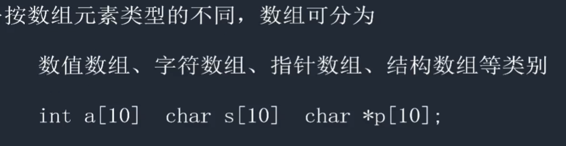

# C语言01--数组

## 数组的概念


## 数组的分类




## 一维数组

### 定义


需求:请定义一个数组该数组有10个元素每个元素为int

**在定义的时候:**

- `arr[]`  : `arr`和`[]`结合是数组
- 将确定的元素的个数放入`[]`中
- 用元素的类型定义一个普通变量
- 从上往下整体替换

```c
int arr[10];
```

**注意:**

1. 数组名`arr `不能和其他变量名同名
2. 数组的元素小标是从0开始:`0~9`
3. 数组的元素分别是:` arr[0]`、`arr[1]~arr[9]`,如果访问`arr[10]`数组越界
4. 数组的元素 等价于 普通变量
5. <mark>在定义数组的时候,里面的值不能是变量(c89)。</mark>

**案例：**遍历数组

```c
void test01() {
    // 局部数组 如果不初始化 内容不确定
    int arr[10];
    
    // 遍历数组
    for (int i=0; i < 10; i++) {
        printf("%d ", arr[i]);
    }
    printf("\n");
}
```


### 初始化

初始化

> 定义的时候给变量或数组元素赋值的动作叫初始化


#### 全部初始化

```c
int arr[5] = {1, 2, 3, 4, 5};

// 如果是全部初始化数组元素的个数可以省略实际的元素个数由初始化个数决定
int arr[] = {10, 20, 30, 40, 50};  // 少用

// 错误初始化
int arr[];
```


#### 部分初始化

```c
// 未被初始化的部分，自动补0
int arr[5] = {10, 20, 30};

// 初始化数组常见操作（将数组所有元素清零）
int arr[5] = {0};  // 只初始化arr[0]=0，未被初始化部分，自动补0
int arr[5] = {2};  // 2 0 0 0 0

// 指定位置初始化
int arr[5] = {[2]=3, [4]=7};  // 0 0 3 0 7
```


### 数组的空间大小

```c
void test02() {
    int arr[5] = {10, 20, 30};
    printf("size of arr is %d bytes\n", sizeof(arr));  // 20 bytes

    printf("size of element in arr is %d bytes\n", sizeof(arr[0]));  // 4 bytes

    int n = sizeof(arr) / sizeof(arr[0]);
    printf("numbers of arr is %d\n", n);  // 5
}
```


**案例：**计算数组大小

```c
void test03() {
    int arr1[5] = {1, 2, 3};
    int arr2[] = {1, 2, 3};
    char arr3[5] = {1, 2, 3};
    int arr4[] = {[5] = 7};

    printf("%d\n", sizeof(arr1));
    printf("%d\n", sizeof(arr2));
    printf("%d\n", sizeof(arr3));
    printf("%d\n", sizeof(arr4));
}
```


### 数组元素的操作

数组的元素 等价于 普通变量

```c
void test04() {
    int arr[5] = {1, 2, 3, 4, 5};
    int n = sizeof(arr) / sizeof(arr[0]);
    
    // 赋值
    arr[0] = 100;
    // 自增
    arr[1]++;

    for (int i = 0; i < n; i++) {
        printf("%d ", arr[i]);
    }
}
```


**案例：**

```c
void test05() {
    int arr[5] = {1, 2, 3, 4, 5};
    int n = sizeof(arr) / sizeof(arr[0]);

    printf("input %d numbers\n", n);
    for (int i = 0; i < n; i++) {
        scanf("%d", &arr[i]);
    }

    for (int i = 0; i < n; i++) {
        printf("%d ", arr[i]);
    }
}
```


## 二维数组

### 二维数组的定义


```c
int arr[3][4];  \\ 3行 4列
```


### 二维数组的遍历

```c
void test06() {
    int arr[3][4];  // 局部数组不初始化，元素内容不确定

    for (int i = 0; i < 3; i++){
        for (int j = 0; j < 4; j++) {
            printf("%d ", arr[i][j]);
        }
        printf("\n");
    }
}
```


### 二维数组的初始化

#### 分段初始化

**用`{}`明确表示一行**

```c
int arr[3][4] = {{1, 2, 3, 4}, {6, 7}, {8, 9, 10}};
```


#### 连续初始化

<span style='color:red'>**放满一行，才继续放下一行**</span>

```c
int arr[3][4] = {1, 2, 3, 4, 5, 6, 7, 8, 9, 10};
```


**案例：**

```c
void test07() {
    int arr1[3][4] = {{1, 2}, {3}, {4, 5}};
    int arr2[3][4] = {1, 2, 3, 4, 5};

    printf("%d\n", arr1[1][0] + arr2[1][0]);
}
```


```c
void test08() {
    int arr[3][4] = {0};

    printf("please input numbers: ");
    for (int i = 0; i < 3; i++) {
        for (int j = 0; j < 4; j++) {
            scanf("%d", &arr[i][j]);
        }
    }

    int sum = 0;
    for (int i = 0; i < 3; i++) {
        for (int j = 0; j < 4; j++) {
            sum += arr[i][j];
        }
    }
    printf("sum is %d\n", sum);
}
```


## 字符数组

**字符数组：**<span style='color:green'>本质是数组，只是数组的每个元素是字符；</span>

### 定义及初始化

```c
// 初始化：逐个字符初始化 不推荐
char c1[] = {'c', ' ', 'p', 'r', 'o', 'g'};;
char a1[][5] = {{'B', 'A', 'S', 'I', 'C'}, {'d', 'B', 'A', 'S', 'E'}};

// 初始化：以字符串的形式初始 推荐
char c2[] = "c prog";
char a2[][6] = {"hello", "world"};
```


### 遍历

```c
void test09() {
    char str[6] = "hello";
    
    // 逐个字符遍历
    for (int i = 0; i < 6; i++){
        printf("%c", str[i]);
    }
    printf("\n-----------\n");
    
    // 字符数组利用 %s 整体遍历 推荐
    printf("%s\n", str);
}
```

<mark>**数组名代表数组第 0 个元素的地址**</mark>


**注意**

```c
void test10() {
    char str1[] = {'h', 'e', 'l', 'l', 'o'};  // 逐个字符初始化，系统不会添加 '\0'
    char str2[] = "hello";  // 以字符串初始化，系统会给字符串添加 '\0'

    printf("sizeof(str1) = %d\n", sizeof(str1));  // 5
    printf("sizeof(str2) = %d\n", sizeof(str2));  // 6
    
    // %s 输出的内容 从数组的第0个元素开始逐个输出 直到遇到 '\0' 结束
    printf("%s\n", str1);
    printf("%s\n", str2);
}
```


### 获取键盘输入的字符

**`scanf`和`%s`使用的时候 有个缺点 遇到 空格 会结束输入**

```c
void test11() {
    char buf[128] = "";
    printf("input string\n");
    scanf("%s", buf);  // 遇到空格结束

    printf("buf = %s\n", buf);
}
```

**`gets` 可以获取带 空格 的字符串 但 不管 `buf` 的大小 容易造成内存污染**

```c
void test11() {
    char buf[128] = "";
    printf("input string\n");
    gets(buf);

    printf("buf = %s\n", buf);
}
```

```c
// 当输入字符数大于 10， 会造成内存污染
void test11() {
    char buf[10] = "";
    printf("input string\n");
    gets(buf);

    printf("buf = %s\n", buf);
}
```

**`fgets`函数 既可以获取 带空格的字符串 也可以保证 `buf` 的不越界**

```c
#include<stdio.h>

char *fgets(char *s, int size, FILE *stream);
// s表示存放字符串的空间地址
// size 能够提取字符串的最大长度
// stream stdin 表示标准输入设备
```

```c
void test12() {
    char buf[10] = "";
    printf("input string\n");

    fgets(buf, sizeof(buf), stdin);

    printf("buf = %s\n", buf);
}
```


**案例：**

```c
void test13() {
    char c = 'a';
    
    // 小写 变 大写
    c = c - 32;
    printf("c = %c\n", c);
    
    // 大写 变 小写
    c = c + 32;
    printf("c = %c\n", c);
}
```


### 二维字符数组的遍历

```c
void test14() {
    char str[3][20] = {"hello", "world!", "It is my life!"};

    printf("%s\n", str[0]);
    printf("%s\n", str[1]);
    printf("%s\n", str[2]);
}
```


