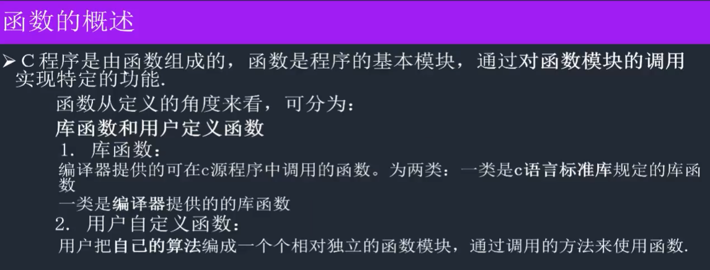
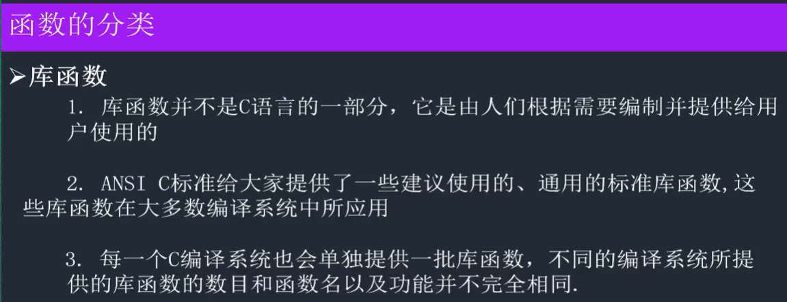
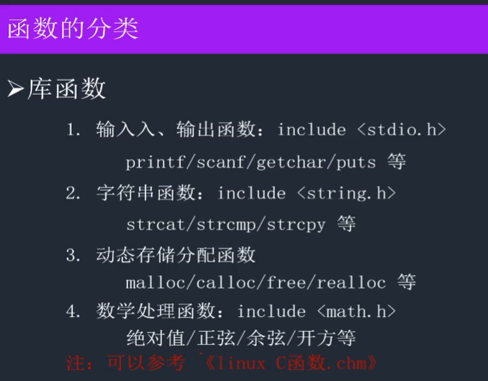
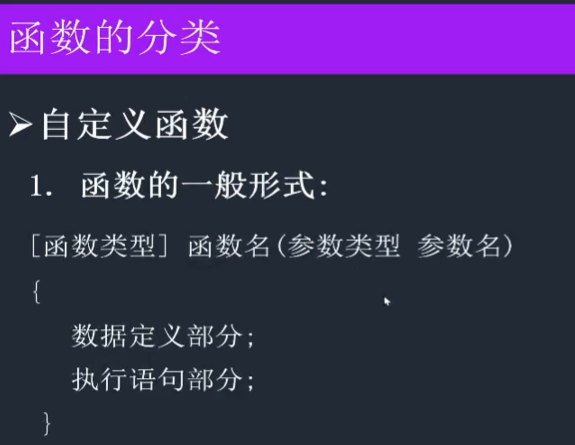
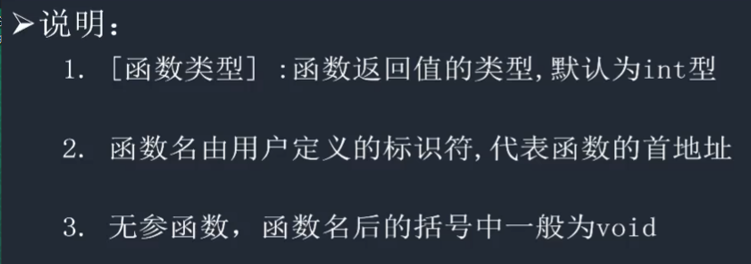
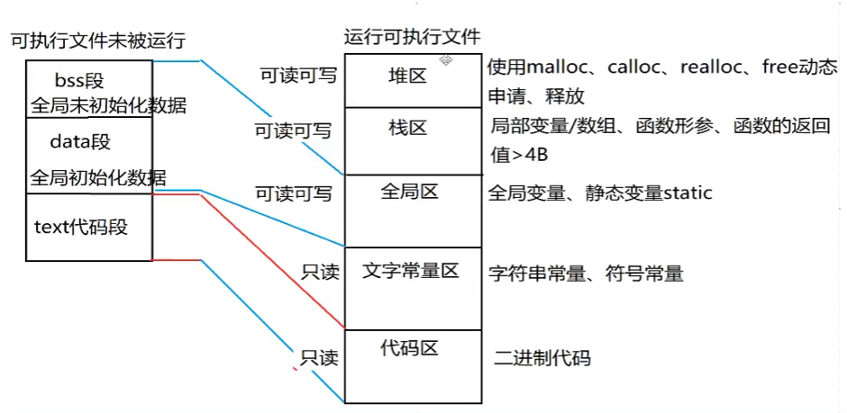
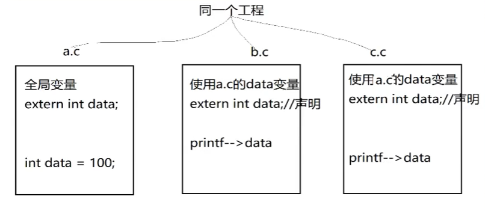
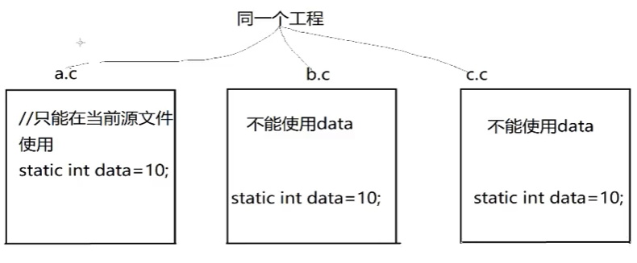
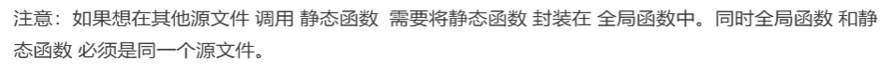

# C02-函数

## 概述




## 分类










## 函数的定义、声明及调用

### 定义

> 实现函数功能、确定函数体、返回值类型、形参类型。让函数存在。

```c
// 返回值类型：函数将来返回值的类型
// 函数名：函数的入口地址
// 形参：函数外部数据 传递到 函数内部的 桥梁
// 函数体：具体函数功能带

返回值类型 函数名(形参类型 形参)
{
    函数体;
}
```

### 声明

> 不是实现函数功能，仅仅是说明该函数有返回值类型、形参类型、函数名，即该函数存在。

```c
返回值类型 函数名(形参类型 形参);
```

### 调用

> 函数的执行

```c
// 函数外部的实际数据
函数名(实参);
```


### 实例

```c
#include <stdio.h>

// 函数声明：告诉编译器，该函数存在，请通过编译器
void myFunc();


int main() {
    // 函数的调用：函数名 + ()
    myFunc();
    return 0;
}

// 函数的定义
void myFunc() {
    printf("my func\n");
    return;
}
```


## 函数的参数

  ```c
int my_add(int a, int b);

int main() {
    int data1, data2;
    data1 = 10;
    data2 = 20;
    printf("result %d", my_add(data1, data2));
    return 0;
}

int my_add(int a, int b) {
    return a + b;
}
  ```


**注意：**

- 函数的<span style='color:red'>形参</span> 本质是 函数的<span style='color:red'>局部变量</span>

  ```c
  int my_add(int a, int b) {  // a, b 就是形参
      // int a, int b;
      return a + b;
  }
  ```

- <span style='color:red'>形参</span> 在<span style='color:red'>函数定义</span>的时候是<span style='color:red'>不会开辟空间</span>，只在<span style='color:red'>函数调用</span>的时候才<span style='color:red'>开辟空间</span>

- <span style='color:red'>形参</span> 在<span style='color:red'>函数结束</span>的时候才被<span style='color:red'>释放</span>

- <span style='color:red'>函数名</span>代表函数的<span style='color:red'>入口地址</span>

  ```c
  void test2() {
      printf("func address: %p\n", my_add);  // my_add 代表函数的入口地址
  
      int dt1 = 15, dt2 = 75;
      int ret = ((int(*)(int, int))(0x004014E3))(dt1, dt2);  // 如果my_add地址不变，可通过地址直接调用函数
      printf("ret = %d\n", ret);
  }
  
  int my_add(int a, int b) {
      return a + b;
  }
  ```

- 函数的返回值 `<=4字节` 存放<span style='color:red'>寄存器</span>，`>4字节` 存放在<span style='color:red'>栈区</span>


**案例：分文件**

`main.c`

```c
#include <stdio.h>
#include "my_func.h"

// 函数声明
// extern 是告诉编译器 该函数 来自于其它文件
//extern void myFunc();
//extern int my_add(int a, int b);
//extern void test01();


int main() {
    test01();
    return 0;
}
```

`my_func.c`

```c
//
// Created by panky on 2021/3/9.
//
#include <stdio.h>

// 函数的定义
void myFunc() {
    printf("my func\n");
    return;
}

int my_add(int a, int b) {
    return a + b;
}

void test01() {
    // 函数的调用：函数名 + ()
    myFunc();

    int data1, data2;
    data1 = 10;
    data2 = 20;
    printf("result %d\n", my_add(data1, data2));

    printf("%p", my_add);
}

void test02() {
    printf("func address: %p\n", my_add);  // my_add 代表函数的入口地址
    int dt1 = 15, dt2 = 75;
    int ret = ((int(*)(int, int))(0x004014E3))(dt1, dt2);  // 如果my_add地址不变，可通过地址直接调用函数
    printf("ret = %d\n", ret);
}
```

`my_func.h`

```c
//
// Created by panky on 2021/3/9.
//

#ifndef C02_FUNCTION_MY_FUNC_H
#define C02_FUNCTION_MY_FUNC_H

#endif //C02_FUNCTION_MY_FUNC_H
// 函数声明
// extern 是告诉编译器 该函数 来自于其它文件
extern void myFunc();
extern int my_add(int a, int b);
extern void test01();
```


## 变量的存储类别

### 内存分区



### 普通局部变量

1. 定义形式：在<span style='color:red'> `{}`里面定义</span>的普通变量，就是普通局部变量

   ```c
   void test() {
       int num1 = 10;  // 普通局部变量
   }
   ```

2. 作用范围：离它最近的`{}`之间有效

   ```c
   void test() {
       int num1 = 20;
       {
           int num2 = 100;  // 作用范围为最临近的 {}
       }
   }
   ```

3. 生命周期：离它最近的`{}`之间有效，离开`{}`的局部变量，系统自动回收

4. 存储区域：栈区

5. 注意事项

   1. 普通局部变量如果不初始化，内容不确定

      ```c
      void test() {
          int data;
          printf("data = %d\n", data);
      }
      ```

   2. 普通局部变量 同名 就近原则

      ```c
      void test() {
          int data = 100;
          {
              int data = 200;
              printf("A:data = %d\n", data);
          }
          printf("B:data = %d\n", data);
      }
      ```


### 普通全局变量

1. 定义形式：定义在函数外部的变量

   ```c
   int data;  // 普通全局变量 在函数外部定义
   
   void test() {
       printf("test;");
   }
   ```

2. 作用范围：当前源文件都有效；其它源文件使用全局变量，必须加`extern`声明

   `extern`本质：告诉编译器 函数/变量 来自其它源文件，请通过编译

   

3. 生命周期：整个<span style='color:red'> 进程</span>都有效（程序结束的时候，全局变量 才被释放）

4. 存储区域：全局区

5. 注意事项

   1. 全局变量 不初始化，内容为 `0`
   2. 如果全局变量 要在其它源文件中使用，必须在所使用的源文件中加extern声明


### 静态局部变量

1. 定义形式：在`{}`中定义 前面 必须加 `static` 修饰

   ```c
   void test() {
       static int num;  // 静态局部变量
       return;
   }
   ```

2. 作用范围：离它最近的`{}`之间有效

3. 生命周期：整个进程（<span style='color:red'>程序结束</span>的时候 静态局部变量 才被<span style='color:red'>释放</span>）

   ```c
   #include <stdio.h>
   
   void func1() {
       int num = 10;  // 普通局部变量
       num++;
       printf("num = %d\n", num);
   }
   
   void func2() {
       // 何为初始：给变量开辟空间时才有初始化
       // 静态局部变量 只能被初始一次
       static int mun = 10;  // 静态局部变量,第二次调用该函数时，不再初始化
       num++;
       printf("num = %d\n", num);
   }
   
   int main() {
       func1();  // 11
       func1();  // 11
       func1();  // 11
       
       func2();  // 11
       func2();  // 12
       func2();  // 13
       return 0;
   }
   ```

4. 存储区域：全局区

5. 注意事项

   1. 静态局部变量，如果不初始化，内容为 `0`
   2. 只能被定义一次


### 静态全局变量

1. 定义形式：在函数外部定义 同时加`static`这样的变量就是静态全局变量

   ```c
   #include<stdio.h>
   
   static int data = 10;  // 静态全局变量
   
   int main(int argc, char * argv[]){
       return 0;
   }
   ```

2. 作用范围：<span style='color:red'>当前源文件</span>有效，不能在其它源文件中使用

   

3. 生命周期：整个进程（程序结束 静态全局变量才被释放）

4. 存储区域：全局区

5. 注意事项

   1. 静态全局变量 不初始化 内容为 `0`
   2. 静态全局变量 只在当前源文件中 有效


## 函数补充

### 全局函数(普通函数)

```c
void my_func(void){
    printf("全局函数（普通函数）");
}
```

**特点：**其它源文件可以使用 全局函数（普通函数），必须加 `extern`声明


### 静态函数(局部函数)

```c
static void my_func() {
    printf("静态函数（局部函数）");
}
```

**特点：**只能在当前源文件使用 <span style='color:red'>不能在其它源文件</span>使用。

