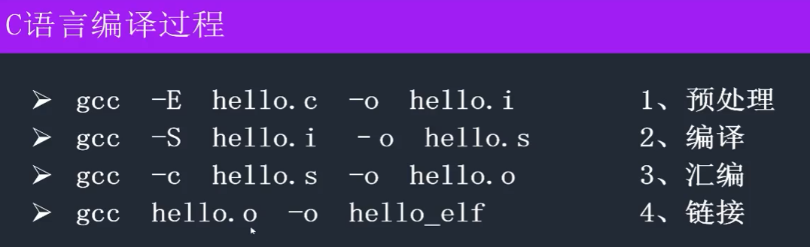

# C03-编译

## C语言编译过程

- **预处理：**头文件包含、宏替换、条件编译、删除注释  不做语法检查
- **编译：**将预处理后的文件 生成 汇编文件 语法检查
- **汇编：**将汇编文件 编译成 二进制文件
- **连接：**将众多的二进制文件 + 库 + 启动代码 生成 可执行文件

**总结：** 一步到位 编译：`gcc 源文件 -o 可执行文件`

## #include

## #define

## 条件编译

## 二进制的概述和操作

